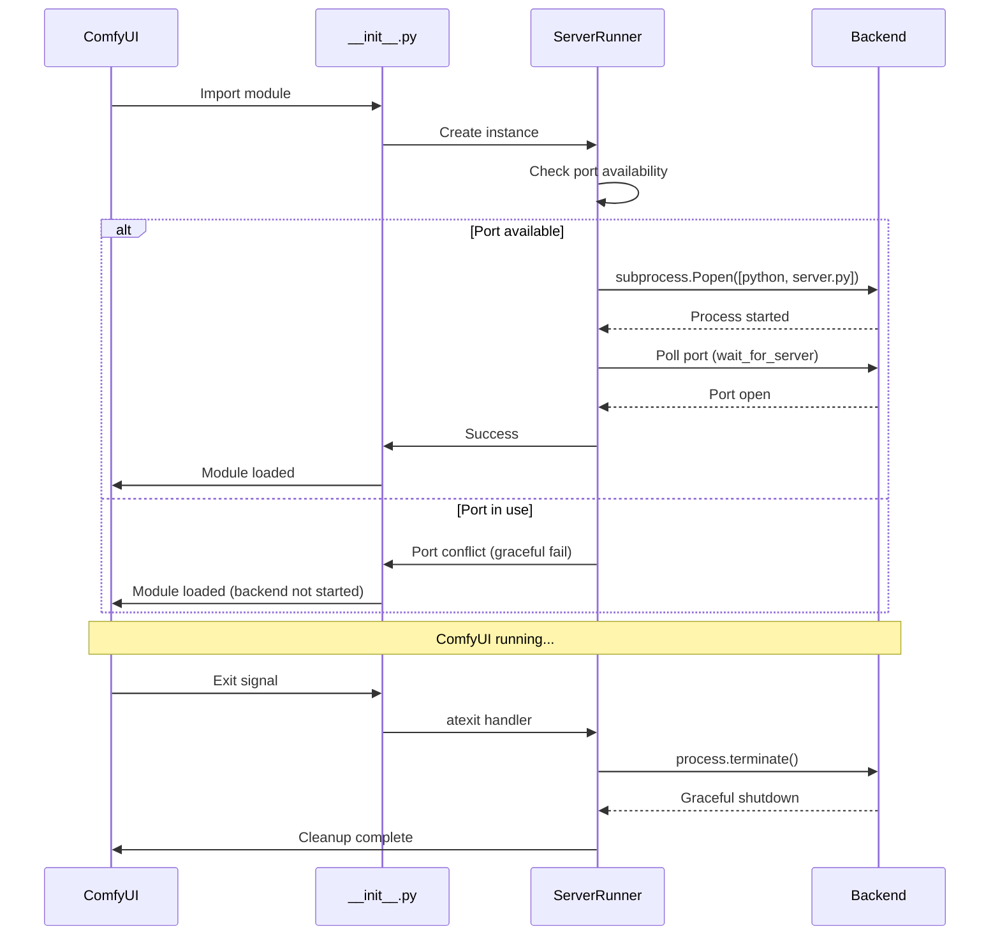

# FL_JS Backend Auto-Start - Code Investigation

**Date:** 2025-10-14  
**Purpose:** Plan the code changes needed to auto-start the FastAPI backend

---

## Overview

Based on research (see [research.md](./research.md)), we'll implement automatic backend startup using the subprocess approach inspired by ComfyUI-NODEJS.

---

## Files to Create/Modify

### 1. Create `backend/server_runner.py` (NEW)

**Purpose:** Manage FastAPI backend subprocess lifecycle

**Key Components:**
```python
import sys
import os
import subprocess
import atexit
import socket
import time
from typing import Optional

class ServerRunner:
    """Manages FL_JS FastAPI backend server subprocess."""
    
    def __init__(self, backend_dir: str, port: int = 8000, auto_start: bool = True):
        """Initialize server runner.
        
        Args:
            backend_dir: Path to backend directory
            port: Port to run server on
            auto_start: Whether to start immediately
        """
        self.backend_dir = backend_dir
        self.port = port
        self.process: Optional[subprocess.Popen] = None
        self._cleaned_up = False
        
        # Register cleanup handlers
        atexit.register(self.cleanup)
        
        if auto_start:
            self.start()
    
    def is_port_in_use(self) -> bool:
        """Check if the port is already in use."""
        with socket.socket(socket.AF_INET, socket.SOCK_STREAM) as s:
            return s.connect_ex(('localhost', self.port)) == 0
    
    def start(self) -> bool:
        """Start the FastAPI backend server.
        
        Returns:
            True if started successfully, False otherwise
        """
        if self.process is not None:
            print("[FL_JS] Backend already running")
            return True
        
        # Check port availability
        if self.is_port_in_use():
            print(f"[FL_JS] Port {self.port} already in use. Backend not started.")
            print(f"[FL_JS] If you're running the backend manually, this is OK.")
            return False
        
        try:
            # Use same Python as ComfyUI
            python_exe = sys.executable
            server_script = os.path.join(self.backend_dir, "server.py")
            
            if not os.path.exists(server_script):
                print(f"[FL_JS] Error: server.py not found at {server_script}")
                return False
            
            print(f"[FL_JS] Starting backend server on port {self.port}...")
            
            # Start subprocess
            self.process = subprocess.Popen(
                [python_exe, server_script],
                cwd=self.backend_dir,
                stdout=None,  # Inherit stdout (logs to ComfyUI console)
                stderr=None,  # Inherit stderr
            )
            
            # Wait for server to be ready
            if self.wait_for_server(timeout=10):
                print(f"[FL_JS] Backend server started successfully! (PID: {self.process.pid})")
                return True
            else:
                print("[FL_JS] Backend server failed to start (timeout)")
                self.cleanup()
                return False
        
        except Exception as e:
            print(f"[FL_JS] Failed to start backend server: {e}")
            return False
    
    def wait_for_server(self, timeout: int = 10) -> bool:
        """Wait for server to become available.
        
        Args:
            timeout: Maximum seconds to wait
        
        Returns:
            True if server is ready, False if timeout
        """
        start_time = time.time()
        
        while time.time() - start_time < timeout:
            if self.is_port_in_use():
                # Give it a moment to fully initialize
                time.sleep(0.5)
                return True
            time.sleep(0.5)
        
        return False
    
    def cleanup(self):
        """Terminate the backend server process."""
        if self._cleaned_up:
            return
        
        self._cleaned_up = True
        
        if self.process is not None:
            try:
                print(f"[FL_JS] Terminating backend server (PID: {self.process.pid})...")
                self.process.terminate()
                
                # Wait up to 5 seconds for graceful shutdown
                try:
                    self.process.wait(timeout=5)
                    print("[FL_JS] Backend server terminated gracefully")
                except subprocess.TimeoutExpired:
                    print("[FL_JS] Backend server did not terminate, killing...")
                    self.process.kill()
                    self.process.wait()
                    print("[FL_JS] Backend server killed")
            
            except Exception as e:
                print(f"[FL_JS] Error during cleanup: {e}")
            
            finally:
                self.process = None
    
    def __del__(self):
        """Destructor: ensure cleanup on garbage collection."""
        self.cleanup()
```

**Key Features:**
- ✅ Port conflict detection
- ✅ Health check with timeout
- ✅ Hybrid cleanup (atexit + __del__)
- ✅ Graceful shutdown with fallback to kill
- ✅ Uses ComfyUI's Python interpreter
- ✅ Inherits stdout/stderr for debugging
- ✅ Idempotent cleanup

---

### 2. Modify `__init__.py`

**Current Code:**
```python
"""
FL_JS Agentic System - ComfyUI Custom Node
"""

NODE_CLASS_MAPPINGS = {}
NODE_DISPLAY_NAME_MAPPINGS = {}
WEB_DIRECTORY = "./web/js"

__all__ = ["NODE_CLASS_MAPPINGS", "NODE_DISPLAY_NAME_MAPPINGS", "WEB_DIRECTORY"]
```

**New Code:**
```python
"""
FL_JS Agentic System - ComfyUI Custom Node

Automatically starts the FastAPI backend server when ComfyUI loads.
"""

import os
import sys

# Add backend to Python path
BACKEND_DIR = os.path.join(os.path.dirname(os.path.abspath(__file__)), "backend")
sys.path.insert(0, BACKEND_DIR)

# Import configuration
try:
    from backend.config import settings
    AUTO_START = settings.AUTO_START_BACKEND
    PORT = settings.WS_PORT
except ImportError:
    print("[FL_JS] Warning: Could not load config, using defaults")
    AUTO_START = True
    PORT = 8000

# Start backend server if enabled
if AUTO_START:
    try:
        from backend.server_runner import ServerRunner
        
        print("[FL_JS] Initializing backend server...")
        server_runner = ServerRunner(
            backend_dir=BACKEND_DIR,
            port=PORT,
            auto_start=True
        )
        
        # Keep reference to prevent garbage collection
        _FL_JS_SERVER = server_runner
        
    except Exception as e:
        print(f"[FL_JS] Failed to start backend server: {e}")
        print(f"[FL_JS] You can start it manually: cd backend && python server.py")
else:
    print("[FL_JS] Backend auto-start disabled. Start manually: cd backend && python server.py")

# Export ComfyUI custom node mappings
NODE_CLASS_MAPPINGS = {}
NODE_DISPLAY_NAME_MAPPINGS = {}
WEB_DIRECTORY = "./web/js"

__all__ = ["NODE_CLASS_MAPPINGS", "NODE_DISPLAY_NAME_MAPPINGS", "WEB_DIRECTORY"]
```

**Changes:**
1. Import `ServerRunner` class
2. Read config for `AUTO_START_BACKEND` and port
3. Create global `server_runner` instance
4. Store reference to prevent garbage collection
5. Error handling with fallback message
6. Respect `AUTO_START` config flag

---

### 3. Modify `backend/config.py`

**Add new settings:**
```python
class Settings(BaseSettings):
    # ... existing settings ...
    
    # === Backend Auto-Start ===
    AUTO_START_BACKEND: bool = True  # Whether to auto-start backend on ComfyUI load
    
    # ... rest of settings ...
```

**Update `.env.example`:**
```bash
# === Backend Auto-Start ===
AUTO_START_BACKEND=true          # Auto-start backend when ComfyUI loads
```

---

### 4. Add Health Check Endpoint to `backend/server.py`

**Add route:**
```python
@app.get("/health")
async def health_check():
    """Health check endpoint for startup verification."""
    return {
        "status": "healthy",
        "service": "FL_JS Backend",
        "version": "0.1.5"
    }
```

**Purpose:**
- Allows `ServerRunner` to verify server is ready
- Can be used for monitoring
- Simple HTTP GET (no WebSocket needed)

---

## Execution Flow



---

## Error Handling Strategy

### Scenario 1: Port Already in Use
```
[FL_JS] Port 8000 already in use. Backend not started.
[FL_JS] If you're running the backend manually, this is OK.
```
**Action:** Continue loading extension, frontend will connect if backend is running

### Scenario 2: server.py Not Found
```
[FL_JS] Error: server.py not found at /path/to/backend/server.py
```
**Action:** Fail gracefully, provide manual start instructions

### Scenario 3: Server Fails to Start
```
[FL_JS] Backend server failed to start (timeout)
[FL_JS] Check logs for errors. You can start manually: cd backend && python server.py
```
**Action:** Cleanup subprocess, provide manual instructions

### Scenario 4: Backend Crashes During Runtime
```
[FL_JS] Backend process terminated unexpectedly
```
**Action:** Log error, do NOT auto-restart (keep it simple)
**User Action:** Restart ComfyUI

---

## Testing Checklist

### Unit Tests
- [ ] `ServerRunner.is_port_in_use()` works correctly
- [ ] `ServerRunner.start()` launches subprocess
- [ ] `ServerRunner.cleanup()` terminates process
- [ ] `ServerRunner.wait_for_server()` times out properly
- [ ] Idempotent cleanup (calling twice is safe)

### Integration Tests
- [ ] Backend starts when ComfyUI loads
- [ ] Backend stops when ComfyUI exits
- [ ] Port conflict detected and handled
- [ ] Health check endpoint responds
- [ ] Frontend can connect via WebSocket
- [ ] No zombie processes after ComfyUI exit

### Platform Tests
- [ ] Works on Windows
- [ ] Works on Linux
- [ ] Works on macOS

### Edge Cases
- [ ] Backend crashes immediately after start
- [ ] Port becomes available after initial conflict
- [ ] Multiple ComfyUI instances running
- [ ] Backend started manually before ComfyUI
- [ ] ComfyUI killed with SIGKILL (cleanup may not run)

---

## Configuration Options

### For Users Who Want Manual Control

**Option 1: Disable auto-start in `.env`**
```bash
AUTO_START_BACKEND=false
```

**Option 2: Run backend on different port**
```bash
WS_PORT=8001
```
(Frontend needs to be updated to match)

**Option 3: Start manually (always works)**
```bash
cd backend
python server.py
```

---

## Documentation Updates Needed

### README.md

**Old Installation:**
```markdown
#### 4. Start the backend server

The backend must be running for the extension to work:

```bash
cd backend
python server.py
```

> **Keep this terminal open** while using FL_JS!
```

**New Installation:**
```markdown
#### 4. Start ComfyUI

The backend server starts automatically when ComfyUI loads:

```bash
cd /path/to/ComfyUI
python main.py
```

You should see:
```
[FL_JS] Initializing backend server...
[FL_JS] Starting backend server on port 8000...
[FL_JS] Backend server started successfully! (PID: 12345)
```

> **Note:** If port 8000 is in use, you can change it in `.env` (WS_PORT=8001)

**Manual Start (Optional):**
If you prefer to start the backend manually:
1. Set `AUTO_START_BACKEND=false` in `.env`
2. Run: `cd backend && python server.py`
```

### Troubleshooting Section

Add:
```markdown
### Backend doesn't start automatically

**Check ComfyUI console for errors:**
- `Port already in use` - Another service is using port 8000
- `server.py not found` - Installation incomplete
- `Failed to start (timeout)` - Backend crashed, check logs

**Solutions:**
1. Change port in `.env`: `WS_PORT=8001`
2. Check backend dependencies: `pip install -r requirements.txt`
3. Start manually: `cd backend && python server.py`
4. Check logs for detailed errors

### Backend process won't stop

**Find and kill the process:**
```bash
# Linux/Mac
lsof -i :8000
kill <PID>

# Windows
netstat -ano | findstr :8000
taskkill /PID <PID> /F
```
```

---

## Implementation Priority

### Phase 1: Core Functionality (This Session)
1. ✅ Research complete
2. ✅ Investigation complete
3. ⏸ Create `backend/server_runner.py`
4. ⏸ Update `__init__.py`
5. ⏸ Add health endpoint to `backend/server.py`
6. ⏸ Update `backend/config.py`
7. ⏸ Update `.env.example`

### Phase 2: Testing (Next Session)
1. Manual testing on development machine
2. Test port conflict scenarios
3. Test cleanup on exit
4. Verify no zombie processes

### Phase 3: Documentation (Next Session)
1. Update README.md
2. Update troubleshooting guide
3. Add configuration examples

### Phase 4: Advanced Features (Future)
1. Auto-restart on crash (optional)
2. Log file output (optional)
3. Multiple backend instances (optional)
4. Docker support (optional)

---

## Security Considerations

### 1. Command Injection Prevention
✅ Using list form for subprocess: `[python_exe, "server.py"]`  
✅ No `shell=True` parameter  
✅ No user input in command construction

### 2. Port Binding
⚠️ Currently binds to `0.0.0.0` (all interfaces)  
🔒 Future: Add option to bind to `127.0.0.1` only

### 3. Process Isolation
✅ Separate process space  
✅ No shared memory  
✅ Communication via WebSocket only

---

## Open Questions

1. **Should we add a "restart backend" button in the UI?**
   - Useful for development
   - Adds complexity
   - Can always restart ComfyUI

2. **Should we log backend output to a file by default?**
   - Pros: Separate logs, easier debugging
   - Cons: File management, users might not find it
   - Current: Inherit stdout (appears in ComfyUI console)

3. **Should we support multiple backend instances for different ports?**
   - Use case: Multiple ComfyUI instances
   - Complexity: Port management, process tracking
   - Current: Single instance per ComfyUI

4. **Should we add a "backend status" indicator in the UI?**
   - Shows if backend is running
   - Shows connection status
   - Phase 4 feature

---

## Next Steps

1. **Implement `backend/server_runner.py`** ✅ Ready to code
2. **Update `__init__.py`** ✅ Ready to code
3. **Add health endpoint** ✅ Ready to code
4. **Update config** ✅ Ready to code
5. **Test manually** ⏸ After implementation
6. **Update docs** ⏸ After testing
7. **Commit changes** ⏸ After docs

---

**Status:** Ready for implementation! 🚀
