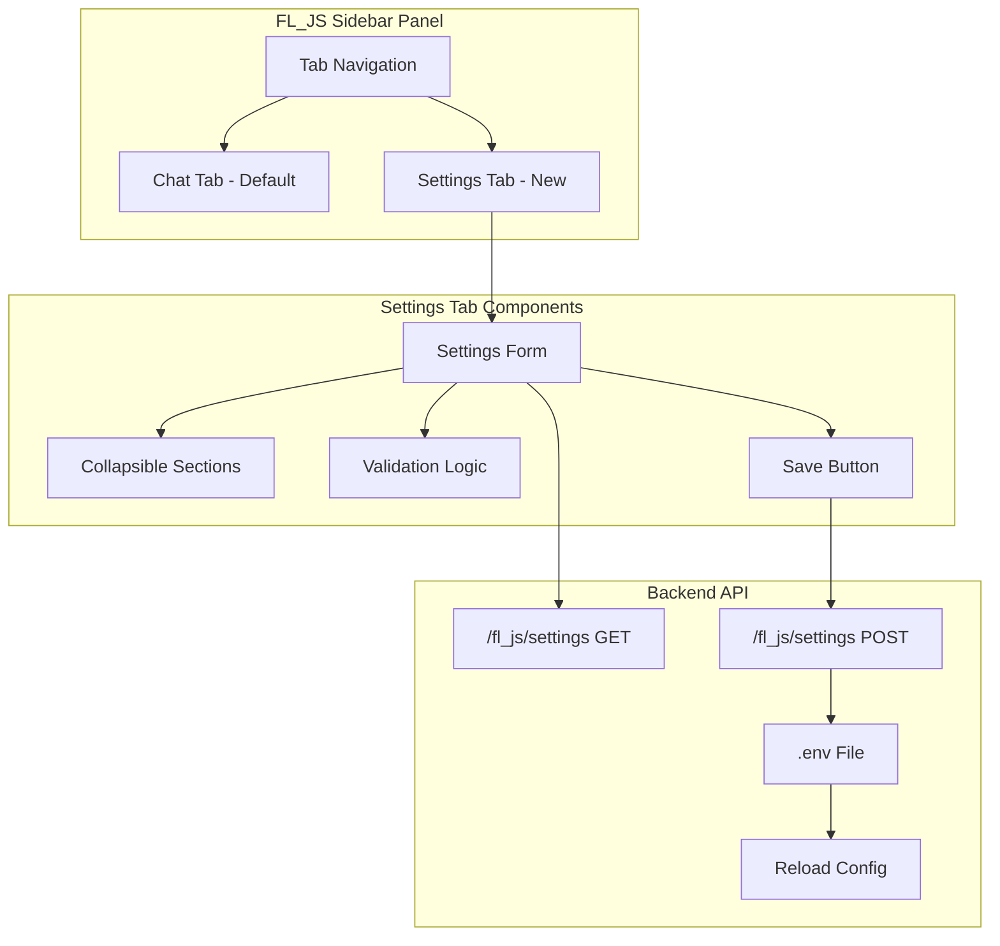

# Settings Tab Feature

**Feature Request:**  
> "Take all the environment config for the server and make a tab in the chat panel... take all the stuff in .env.example and make that into a form that sets the .env file in the backend folder... that can be properly also configurable from the frontend :D"

---

## 🎯 Feature Overview

**Goal:** Add a settings tab to the FL_JS Assistant sidebar panel that allows users to configure all backend settings through a visual form interface, eliminating the need to manually edit `.env` files.

**User Benefit:**  
- No need to manually edit `.env` files
- Visual form with validation and help text
- Real-time configuration updates
- API key management with masked inputs
- Provider-specific settings shown/hidden based on selection
- Settings validation before saving
- Restart server with new settings in one click

**Priority:** High (Quality of Life improvement)

---

## 🏗️ Architecture Design

### Multi-Tab Sidebar Layout

ComfyUI extensions can create custom sidebars with multiple tabs. We'll use a tabbed interface within our sidebar panel.



### Configuration Categories

Based on `backend/config.py`, we have these setting groups:

1. **Backend Auto-Start** (3 settings)
2. **LLM Provider** (4 settings + provider-specific API keys)
3. **API Keys** (4 keys - shown based on provider)
4. **WebSocket Settings** (5 settings)
5. **Connection Limits** (2 settings)
6. **Tool Execution** (2 settings)
7. **Conversation** (1 setting)
8. **Logging** (2 settings)

**Total:** 23 configuration options

---

## 🎨 UI Design

### Tab Navigation

```
┌─────────────────────────────────┐
│ FL_JS Assistant    ● Connected   │
├─────────────────────────────────┤
│ [💬 Chat] [⚙️ Settings]          │ ← Tab buttons
├─────────────────────────────────┤
│                                 │
│ [Tab content here]              │
│                                 │
└─────────────────────────────────┘
```

### Settings Tab Layout

```
┌─────────────────────────────────┐
│ FL_JS Assistant    ● Connected   │
├─────────────────────────────────┤
│ [💬 Chat] [⚙️ Settings]          │
├─────────────────────────────────┤
│ ⚙️ Backend Configuration        │
│                                 │
│ ▼ Backend Auto-Start            │ ← Collapsible section
│   ☑ Auto-start backend          │
│   ☑ Auto-restart on crash       │
│   ☑ Log to file                 │
│                                 │
│ ▼ LLM Provider                  │
│   Provider: [OpenAI ▼]          │
│   Model: [gpt-4-turbo... ▼]     │
│   Temperature: [0.7] ━━●━━      │
│   Max Tokens: [32000]           │
│                                 │
│ ▼ API Keys                      │
│   OpenAI: [••••••••••] [👁]     │
│   Status: ✅ Valid              │
│                                 │
│ ▼ WebSocket Settings            │
│   Host: [0.0.0.0]               │
│   Port: [8000]                  │
│   ... (more settings)           │
│                                 │
│ ▼ Advanced Settings             │
│   ... (collapsed by default)    │
│                                 │
├─────────────────────────────────┤
│ [💾 Save & Restart] [↻ Reset]   │ ← Action buttons
└─────────────────────────────────┘
```

### Collapsible Sections

Each section can be expanded/collapsed to reduce visual clutter:

```
▼ LLM Provider                    ← Expanded
  [Settings visible]

▶ Advanced Settings               ← Collapsed
```

### Input Types

1. **Text Input** - For strings (host, model name)
2. **Number Input** - For integers (port, timeouts)
3. **Slider** - For floats (temperature: 0.0-2.0)
4. **Dropdown** - For enums (provider, log level)
5. **Checkbox** - For booleans (auto-start flags)
6. **Password Input** - For API keys (masked with toggle)

### Provider-Specific UI

When user selects a provider, only show that provider's API key:

```
Provider: [OpenAI ▼]

▼ API Keys
  OpenAI API Key: [••••••••••] [👁]
  Status: ✅ Valid
  
  (Anthropic, Google, OpenRouter keys hidden)
```

---

## 🔧 Technical Implementation

### Phase 1: Backend Settings API

**File:** `__init__.py` (add endpoints)

```python
from pathlib import Path
import json
from typing import Any

@PromptServer.instance.routes.get("/fl_js/settings")
async def get_settings_endpoint(request):
    """Get current settings from .env file.
    
    Returns sanitized settings (API keys masked).
    """
    try:
        from backend.config import settings
        
        # Get all settings
        settings_dict = {
            # Backend Auto-Start
            "auto_start_backend": settings.auto_start_backend,
            "auto_restart_backend": settings.auto_restart_backend,
            "log_backend_to_file": settings.log_backend_to_file,
            
            # LLM Provider
            "llm_provider": settings.llm_provider,
            "llm_model": settings.llm_model,
            "llm_temperature": settings.llm_temperature,
            "llm_max_tokens": settings.llm_max_tokens,
            
            # API Keys (masked)
            "openai_api_key": _mask_api_key(settings.openai_api_key),
            "anthropic_api_key": _mask_api_key(settings.anthropic_api_key),
            "google_api_key": _mask_api_key(settings.google_api_key),
            "openrouter_api_key": _mask_api_key(settings.openrouter_api_key),
            
            # API Key Status
            "api_key_status": _check_api_key_status(settings),
            
            # WebSocket
            "ws_host": settings.ws_host,
            "ws_port": settings.ws_port,
            "ws_heartbeat_interval": settings.ws_heartbeat_interval,
            "ws_session_timeout": settings.ws_session_timeout,
            "ws_max_reconnect_attempts": settings.ws_max_reconnect_attempts,
            
            # Connection Limits
            "max_connections_per_ip": settings.max_connections_per_ip,
            "max_message_size": settings.max_message_size,
            
            # Tool Execution
            "tool_timeout": settings.tool_timeout,
            "max_tool_retries": settings.max_tool_retries,
            
            # Conversation
            "conversation_max_history": settings.conversation_max_history,
            
            # Logging
            "log_level": settings.log_level,
            "log_format": settings.log_format,
        }
        
        return web.json_response({"success": True, "settings": settings_dict})
        
    except Exception as e:
        logger.error(f"Error getting settings: {e}", exc_info=True)
        return web.json_response(
            {"success": False, "error": str(e)},
            status=500
        )


@PromptServer.instance.routes.post("/fl_js/settings")
async def update_settings_endpoint(request):
    """Update settings and save to .env file.
    
    Validates settings before saving.
    Requires server restart to take effect.
    """
    try:
        data = await request.json()
        new_settings = data.get("settings", {})
        
        # Validate settings
        validation_result = _validate_settings(new_settings)
        if not validation_result["valid"]:
            return web.json_response(
                {"success": False, "error": validation_result["error"]},
                status=400
            )
        
        # Save to .env file
        env_path = Path(__file__).parent / "backend" / ".env"
        _save_env_file(env_path, new_settings)
        
        # Return success (server needs restart)
        return web.json_response({
            "success": True,
            "message": "Settings saved. Restart server to apply changes.",
            "requires_restart": True
        })
        
    except Exception as e:
        logger.error(f"Error updating settings: {e}", exc_info=True)
        return web.json_response(
            {"success": False, "error": str(e)},
            status=500
        )


@PromptServer.instance.routes.post("/fl_js/settings/validate")
async def validate_settings_endpoint(request):
    """Validate settings without saving.
    
    Useful for real-time validation in UI.
    """
    try:
        data = await request.json()
        settings = data.get("settings", {})
        
        result = _validate_settings(settings)
        return web.json_response(result)
        
    except Exception as e:
        logger.error(f"Error validating settings: {e}", exc_info=True)
        return web.json_response(
            {"valid": False, "error": str(e)},
            status=500
        )


@PromptServer.instance.routes.post("/fl_js/settings/test-api-key")
async def test_api_key_endpoint(request):
    """Test an API key without saving.
    
    Makes a minimal API call to verify the key works.
    """
    try:
        data = await request.json()
        provider = data.get("provider")
        api_key = data.get("api_key")
        
        if not provider or not api_key:
            return web.json_response(
                {"valid": False, "error": "provider and api_key required"},
                status=400
            )
        
        # Test the API key
        result = await _test_api_key(provider, api_key)
        return web.json_response(result)
        
    except Exception as e:
        logger.error(f"Error testing API key: {e}", exc_info=True)
        return web.json_response(
            {"valid": False, "error": str(e)},
            status=500
        )


# Helper functions

def _mask_api_key(key: str) -> str:
    """Mask API key for display."""
    if not key:
        return ""
    if len(key) <= 8:
        return "•" * len(key)
    return key[:4] + "•" * (len(key) - 8) + key[-4:]


def _check_api_key_status(settings) -> dict[str, str]:
    """Check which API keys are configured."""
    return {
        "openai": "configured" if settings.openai_api_key else "missing",
        "anthropic": "configured" if settings.anthropic_api_key else "missing",
        "google": "configured" if settings.google_api_key else "missing",
        "openrouter": "configured" if settings.openrouter_api_key else "missing",
    }


def _validate_settings(settings: dict[str, Any]) -> dict[str, Any]:
    """Validate settings before saving."""
    errors = []
    
    # Validate provider
    provider = settings.get("llm_provider")
    if provider not in ["openai", "anthropic", "gemini", "openrouter"]:
        errors.append(f"Invalid provider: {provider}")
    
    # Validate temperature
    temp = settings.get("llm_temperature")
    if temp is not None and (temp < 0 or temp > 2.0):
        errors.append("Temperature must be between 0 and 2.0")
    
    # Validate port
    port = settings.get("ws_port")
    if port is not None and (port < 1024 or port > 65535):
        errors.append("Port must be between 1024 and 65535")
    
    # Validate timeouts
    timeouts = [
        ("ws_heartbeat_interval", settings.get("ws_heartbeat_interval")),
        ("ws_session_timeout", settings.get("ws_session_timeout")),
        ("tool_timeout", settings.get("tool_timeout")),
    ]
    for name, value in timeouts:
        if value is not None and value < 1:
            errors.append(f"{name} must be positive")
    
    # Validate API key for selected provider
    if provider:
        key_field = f"{provider}_api_key"
        if provider == "gemini":
            key_field = "google_api_key"
        
        api_key = settings.get(key_field)
        if not api_key or api_key.startswith("•"):
            errors.append(f"API key required for {provider}")
    
    if errors:
        return {"valid": False, "error": "; ".join(errors)}
    
    return {"valid": True}


def _save_env_file(env_path: Path, settings: dict[str, Any]) -> None:
    """Save settings to .env file.
    
    Preserves comments and formatting where possible.
    """
    lines = []
    
    # Read existing .env if it exists
    existing = {}
    if env_path.exists():
        with open(env_path, "r") as f:
            for line in f:
                line = line.strip()
                if line and not line.startswith("#") and "=" in line:
                    key, value = line.split("=", 1)
                    existing[key.strip()] = value.strip()
    
    # Update with new settings
    for key, value in settings.items():
        env_key = key.upper()
        
        # Skip masked API keys (don't overwrite)
        if "api_key" in key and isinstance(value, str) and "•" in value:
            if env_key in existing:
                lines.append(f"{env_key}={existing[env_key]}")
            continue
        
        # Convert value to string
        if isinstance(value, bool):
            value_str = "true" if value else "false"
        else:
            value_str = str(value)
        
        lines.append(f"{env_key}={value_str}")
    
    # Write to file
    with open(env_path, "w") as f:
        f.write("\n".join(lines) + "\n")


async def _test_api_key(provider: str, api_key: str) -> dict[str, Any]:
    """Test an API key by making a minimal API call."""
    try:
        if provider == "openai":
            import openai
            client = openai.OpenAI(api_key=api_key)
            # Test with minimal request
            client.models.list()
            return {"valid": True, "message": "API key is valid"}
        
        elif provider == "anthropic":
            import anthropic
            client = anthropic.Anthropic(api_key=api_key)
            # Test with minimal request
            client.messages.create(
                model="claude-3-haiku-20240307",
                max_tokens=1,
                messages=[{"role": "user", "content": "test"}]
            )
            return {"valid": True, "message": "API key is valid"}
        
        elif provider == "gemini":
            import google.generativeai as genai
            genai.configure(api_key=api_key)
            # Test with list models
            list(genai.list_models())
            return {"valid": True, "message": "API key is valid"}
        
        elif provider == "openrouter":
            import requests
            response = requests.get(
                "https://openrouter.ai/api/v1/models",
                headers={"Authorization": f"Bearer {api_key}"}
            )
            if response.status_code == 200:
                return {"valid": True, "message": "API key is valid"}
            else:
                return {"valid": False, "error": "Invalid API key"}
        
        return {"valid": False, "error": f"Unknown provider: {provider}"}
        
    except Exception as e:
        return {"valid": False, "error": str(e)}
```

---

### Phase 2: Frontend Settings UI

**File:** `web/js/settings_tab.js` (new)

```javascript
/**
 * Settings Tab - Configuration UI for FL_JS backend
 */

export class SettingsTab {
    constructor(container) {
        this.container = container;
        this.settings = null;
        this.originalSettings = null;
        this.isDirty = false;
        this.expandedSections = new Set(['backend', 'llm', 'api_keys']); // Default expanded
        
        this._initializeUI();
        this._loadSettings();
    }
    
    _initializeUI() {
        this.container.innerHTML = `
            <div class="fl-settings-container">
                <div class="fl-settings-header">
                    <h3>⚙️ Backend Configuration</h3>
                    <div class="fl-settings-status" id="fl-settings-status"></div>
                </div>
                
                <div class="fl-settings-content" id="fl-settings-content">
                    <div class="fl-settings-loading">Loading settings...</div>
                </div>
                
                <div class="fl-settings-footer">
                    <button class="fl-settings-btn primary" id="fl-save-btn" disabled>
                        💾 Save & Restart Server
                    </button>
                    <button class="fl-settings-btn secondary" id="fl-reset-btn" disabled>
                        ↻ Reset Changes
                    </button>
                    <button class="fl-settings-btn secondary" id="fl-export-btn">
                        📥 Export Config
                    </button>
                </div>
            </div>
        `;
        
        // Attach event handlers
        document.getElementById('fl-save-btn').addEventListener('click', () => this._saveSettings());
        document.getElementById('fl-reset-btn').addEventListener('click', () => this._resetSettings());
        document.getElementById('fl-export-btn').addEventListener('click', () => this._exportSettings());
    }
    
    async _loadSettings() {
        try {
            const response = await fetch('/fl_js/settings');
            const data = await response.json();
            
            if (data.success) {
                this.settings = data.settings;
                this.originalSettings = JSON.parse(JSON.stringify(data.settings));
                this._renderSettings();
            } else {
                this._showError('Failed to load settings: ' + data.error);
            }
        } catch (error) {
            console.error('[SettingsTab] Error loading settings:', error);
            this._showError('Failed to load settings: ' + error.message);
        }
    }
    
    _renderSettings() {
        const content = document.getElementById('fl-settings-content');
        content.innerHTML = '';
        
        // Render each section
        content.appendChild(this._renderBackendSection());
        content.appendChild(this._renderLLMSection());
        content.appendChild(this._renderAPIKeysSection());
        content.appendChild(this._renderWebSocketSection());
        content.appendChild(this._renderAdvancedSection());
    }
    
    _renderBackendSection() {
        return this._createSection('backend', '🚀 Backend Auto-Start', [
            this._createCheckbox('auto_start_backend', 'Auto-start backend on ComfyUI launch'),
            this._createCheckbox('auto_restart_backend', 'Auto-restart backend on crash'),
            this._createCheckbox('log_backend_to_file', 'Log backend output to file'),
        ]);
    }
    
    _renderLLMSection() {
        const providers = [
            { value: 'openai', label: 'OpenAI' },
            { value: 'anthropic', label: 'Anthropic (Claude)' },
            { value: 'gemini', label: 'Google Gemini' },
            { value: 'openrouter', label: 'OpenRouter' },
        ];
        
        const models = this._getModelsForProvider(this.settings.llm_provider);
        
        return this._createSection('llm', '🤖 LLM Provider', [
            this._createDropdown('llm_provider', 'Provider', providers, () => this._onProviderChange()),
            this._createDropdown('llm_model', 'Model', models),
            this._createSlider('llm_temperature', 'Temperature', 0, 2.0, 0.1, 'Controls randomness (0=deterministic, 2=very random)'),
            this._createNumber('llm_max_tokens', 'Max Tokens', 1000, 128000, 'Maximum tokens in response'),
        ]);
    }
    
    _renderAPIKeysSection() {
        const provider = this.settings.llm_provider;
        const keyStatus = this.settings.api_key_status || {};
        
        // Only show API key for current provider
        let keyField;
        if (provider === 'openai') {
            keyField = this._createPassword('openai_api_key', 'OpenAI API Key', keyStatus.openai);
        } else if (provider === 'anthropic') {
            keyField = this._createPassword('anthropic_api_key', 'Anthropic API Key', keyStatus.anthropic);
        } else if (provider === 'gemini') {
            keyField = this._createPassword('google_api_key', 'Google API Key', keyStatus.google);
        } else if (provider === 'openrouter') {
            keyField = this._createPassword('openrouter_api_key', 'OpenRouter API Key', keyStatus.openrouter);
        }
        
        return this._createSection('api_keys', '🔑 API Keys', [keyField]);
    }
    
    _renderWebSocketSection() {
        return this._createSection('websocket', '🔌 WebSocket Settings', [
            this._createText('ws_host', 'Host', 'Server bind address'),
            this._createNumber('ws_port', 'Port', 1024, 65535, 'WebSocket port'),
            this._createNumber('ws_heartbeat_interval', 'Heartbeat Interval (s)', 1, 300, 'Seconds between heartbeats'),
            this._createNumber('ws_session_timeout', 'Session Timeout (s)', 1, 3600, 'Session timeout in seconds'),
            this._createNumber('ws_max_reconnect_attempts', 'Max Reconnect Attempts', 1, 100, 'Max reconnection attempts'),
        ]);
    }
    
    _renderAdvancedSection() {
        return this._createSection('advanced', '⚡ Advanced Settings', [
            this._createNumber('max_connections_per_ip', 'Max Connections per IP', 1, 100),
            this._createNumber('max_message_size', 'Max Message Size (bytes)', 1000, 10000000),
            this._createNumber('tool_timeout', 'Tool Timeout (ms)', 1000, 300000),
            this._createNumber('max_tool_retries', 'Max Tool Retries', 0, 10),
            this._createNumber('conversation_max_history', 'Max Conversation History', 1, 1000),
            this._createDropdown('log_level', 'Log Level', [
                { value: 'DEBUG', label: 'Debug' },
                { value: 'INFO', label: 'Info' },
                { value: 'WARNING', label: 'Warning' },
                { value: 'ERROR', label: 'Error' },
            ]),
            this._createDropdown('log_format', 'Log Format', [
                { value: 'json', label: 'JSON' },
                { value: 'text', label: 'Text' },
            ]),
        ], false); // Collapsed by default
    }
    
    // UI component creators
    
    _createSection(id, title, fields, expanded = null) {
        const isExpanded = expanded !== null ? expanded : this.expandedSections.has(id);
        
        const section = document.createElement('div');
        section.className = 'fl-settings-section';
        section.innerHTML = `
            <div class="fl-settings-section-header" data-section="${id}">
                <span class="fl-settings-section-icon">${isExpanded ? '▼' : '▶'}</span>
                <span class="fl-settings-section-title">${title}</span>
            </div>
            <div class="fl-settings-section-content" style="display: ${isExpanded ? 'block' : 'none'}">
            </div>
        `;
        
        const content = section.querySelector('.fl-settings-section-content');
        fields.forEach(field => content.appendChild(field));
        
        // Toggle handler
        section.querySelector('.fl-settings-section-header').addEventListener('click', () => {
            this._toggleSection(id);
        });
        
        return section;
    }
    
    _createText(key, label, helpText = '') {
        const field = this._createFieldWrapper(key, label, helpText);
        const input = document.createElement('input');
        input.type = 'text';
        input.className = 'fl-settings-input';
        input.value = this.settings[key] || '';
        input.addEventListener('input', (e) => this._onFieldChange(key, e.target.value));
        field.appendChild(input);
        return field;
    }
    
    _createNumber(key, label, min, max, helpText = '') {
        const field = this._createFieldWrapper(key, label, helpText);
        const input = document.createElement('input');
        input.type = 'number';
        input.className = 'fl-settings-input';
        input.min = min;
        input.max = max;
        input.value = this.settings[key] || '';
        input.addEventListener('input', (e) => this._onFieldChange(key, parseInt(e.target.value)));
        field.appendChild(input);
        return field;
    }
    
    _createSlider(key, label, min, max, step, helpText = '') {
        const field = this._createFieldWrapper(key, label, helpText);
        const container = document.createElement('div');
        container.className = 'fl-settings-slider-container';
        
        const slider = document.createElement('input');
        slider.type = 'range';
        slider.className = 'fl-settings-slider';
        slider.min = min;
        slider.max = max;
        slider.step = step;
        slider.value = this.settings[key] || 0.7;
        
        const valueDisplay = document.createElement('span');
        valueDisplay.className = 'fl-settings-slider-value';
        valueDisplay.textContent = slider.value;
        
        slider.addEventListener('input', (e) => {
            const value = parseFloat(e.target.value);
            valueDisplay.textContent = value.toFixed(1);
            this._onFieldChange(key, value);
        });
        
        container.appendChild(slider);
        container.appendChild(valueDisplay);
        field.appendChild(container);
        return field;
    }
    
    _createDropdown(key, label, options, onChange = null) {
        const field = this._createFieldWrapper(key, label);
        const select = document.createElement('select');
        select.className = 'fl-settings-select';
        
        options.forEach(opt => {
            const option = document.createElement('option');
            option.value = opt.value;
            option.textContent = opt.label;
            if (this.settings[key] === opt.value) {
                option.selected = true;
            }
            select.appendChild(option);
        });
        
        select.addEventListener('change', (e) => {
            this._onFieldChange(key, e.target.value);
            if (onChange) onChange();
        });
        
        field.appendChild(select);
        return field;
    }
    
    _createCheckbox(key, label) {
        const field = document.createElement('div');
        field.className = 'fl-settings-field fl-settings-checkbox-field';
        
        const checkbox = document.createElement('input');
        checkbox.type = 'checkbox';
        checkbox.id = `fl-setting-${key}`;
        checkbox.className = 'fl-settings-checkbox';
        checkbox.checked = this.settings[key] || false;
        checkbox.addEventListener('change', (e) => this._onFieldChange(key, e.target.checked));
        
        const labelEl = document.createElement('label');
        labelEl.htmlFor = `fl-setting-${key}`;
        labelEl.textContent = label;
        
        field.appendChild(checkbox);
        field.appendChild(labelEl);
        return field;
    }
    
    _createPassword(key, label, status = 'missing') {
        const field = this._createFieldWrapper(key, label);
        const container = document.createElement('div');
        container.className = 'fl-settings-password-container';
        
        const input = document.createElement('input');
        input.type = 'password';
        input.className = 'fl-settings-input';
        input.value = this.settings[key] || '';
        input.placeholder = status === 'configured' ? '••••••••' : 'Enter API key';
        input.addEventListener('input', (e) => this._onFieldChange(key, e.target.value));
        
        const toggleBtn = document.createElement('button');
        toggleBtn.className = 'fl-settings-password-toggle';
        toggleBtn.textContent = '👁';
        toggleBtn.addEventListener('click', () => {
            input.type = input.type === 'password' ? 'text' : 'password';
        });
        
        const testBtn = document.createElement('button');
        testBtn.className = 'fl-settings-btn small';
        testBtn.textContent = '🧪 Test';
        testBtn.addEventListener('click', () => this._testAPIKey(key));
        
        const statusEl = document.createElement('span');
        statusEl.className = `fl-settings-api-status ${status}`;
        statusEl.textContent = status === 'configured' ? '✅ Configured' : '⚠️ Missing';
        
        container.appendChild(input);
        container.appendChild(toggleBtn);
        container.appendChild(testBtn);
        container.appendChild(statusEl);
        field.appendChild(container);
        return field;
    }
    
    _createFieldWrapper(key, label, helpText = '') {
        const field = document.createElement('div');
        field.className = 'fl-settings-field';
        
        const labelEl = document.createElement('label');
        labelEl.className = 'fl-settings-label';
        labelEl.textContent = label;
        field.appendChild(labelEl);
        
        if (helpText) {
            const help = document.createElement('div');
            help.className = 'fl-settings-help';
            help.textContent = helpText;
            field.appendChild(help);
        }
        
        return field;
    }
    
    // Event handlers
    
    _onFieldChange(key, value) {
        this.settings[key] = value;
        this._checkDirty();
        
        // Re-render API keys section if provider changed
        if (key === 'llm_provider') {
            this._renderSettings();
        }
    }
    
    _onProviderChange() {
        // Re-render to show correct API key field
        this._renderSettings();
    }
    
    _checkDirty() {
        this.isDirty = JSON.stringify(this.settings) !== JSON.stringify(this.originalSettings);
        document.getElementById('fl-save-btn').disabled = !this.isDirty;
        document.getElementById('fl-reset-btn').disabled = !this.isDirty;
    }
    
    _toggleSection(id) {
        if (this.expandedSections.has(id)) {
            this.expandedSections.delete(id);
        } else {
            this.expandedSections.add(id);
        }
        this._renderSettings();
    }
    
    async _saveSettings() {
        try {
            // Validate first
            const validateResponse = await fetch('/fl_js/settings/validate', {
                method: 'POST',
                headers: { 'Content-Type': 'application/json' },
                body: JSON.stringify({ settings: this.settings })
            });
            const validateData = await validateResponse.json();
            
            if (!validateData.valid) {
                alert('Validation failed: ' + validateData.error);
                return;
            }
            
            // Save settings
            const response = await fetch('/fl_js/settings', {
                method: 'POST',
                headers: { 'Content-Type': 'application/json' },
                body: JSON.stringify({ settings: this.settings })
            });
            const data = await response.json();
            
            if (data.success) {
                alert('Settings saved! Restarting server...');
                
                // Trigger server restart
                await fetch('/fl_js/server/stop', { method: 'POST' });
                await new Promise(resolve => setTimeout(resolve, 2000));
                await fetch('/fl_js/server/start', { method: 'POST' });
                
                // Reload settings
                this.originalSettings = JSON.parse(JSON.stringify(this.settings));
                this.isDirty = false;
                this._checkDirty();
            } else {
                alert('Failed to save settings: ' + data.error);
            }
        } catch (error) {
            console.error('[SettingsTab] Error saving settings:', error);
            alert('Error saving settings: ' + error.message);
        }
    }
    
    _resetSettings() {
        this.settings = JSON.parse(JSON.stringify(this.originalSettings));
        this._renderSettings();
        this._checkDirty();
    }
    
    _exportSettings() {
        const blob = new Blob([JSON.stringify(this.settings, null, 2)], { type: 'application/json' });
        const url = URL.createObjectURL(blob);
        const a = document.createElement('a');
        a.href = url;
        a.download = 'fl_js_settings.json';
        a.click();
        URL.revokeObjectURL(url);
    }
    
    async _testAPIKey(keyField) {
        const provider = this.settings.llm_provider;
        const apiKey = this.settings[keyField];
        
        if (!apiKey || apiKey.startsWith('•')) {
            alert('Please enter an API key first');
            return;
        }
        
        try {
            const response = await fetch('/fl_js/settings/test-api-key', {
                method: 'POST',
                headers: { 'Content-Type': 'application/json' },
                body: JSON.stringify({ provider, api_key: apiKey })
            });
            const data = await response.json();
            
            if (data.valid) {
                alert('✅ API key is valid!');
            } else {
                alert('❌ API key test failed: ' + data.error);
            }
        } catch (error) {
            alert('Error testing API key: ' + error.message);
        }
    }
    
    _showError(message) {
        const content = document.getElementById('fl-settings-content');
        content.innerHTML = `
            <div class="fl-settings-error">
                ❌ ${message}
            </div>
        `;
    }
    
    _getModelsForProvider(provider) {
        const models = {
            openai: [
                { value: 'gpt-4-turbo-preview', label: 'GPT-4 Turbo' },
                { value: 'gpt-4', label: 'GPT-4' },
                { value: 'gpt-3.5-turbo', label: 'GPT-3.5 Turbo' },
            ],
            anthropic: [
                { value: 'claude-3-opus-20240229', label: 'Claude 3 Opus' },
                { value: 'claude-3-sonnet-20240229', label: 'Claude 3 Sonnet' },
                { value: 'claude-3-haiku-20240307', label: 'Claude 3 Haiku' },
            ],
            gemini: [
                { value: 'gemini-pro', label: 'Gemini Pro' },
                { value: 'gemini-pro-vision', label: 'Gemini Pro Vision' },
            ],
            openrouter: [
                { value: 'openai/gpt-4-turbo-preview', label: 'GPT-4 Turbo (OpenRouter)' },
                { value: 'anthropic/claude-3-opus', label: 'Claude 3 Opus (OpenRouter)' },
                { value: 'google/gemini-pro', label: 'Gemini Pro (OpenRouter)' },
            ],
        };
        return models[provider] || [];
    }
    
    destroy() {
        this.container.innerHTML = '';
    }
}
```

---

### Phase 3: Tab Navigation

**File:** `web/js/chat_ui.js` (update to support tabs)

```javascript
import { SettingsTab } from './settings_tab.js';

export class ChatUI {
    constructor(container, wsClient) {
        this.container = container;
        this.wsClient = wsClient;
        this.messages = [];
        this.isTyping = false;
        this.serverControl = null;
        this.settingsTab = null;
        this.currentTab = 'chat'; // 'chat' or 'settings'
        
        // ... existing code ...
        
        this._initializeUI();
        this._attachEventHandlers();
    }
    
    _initializeUI() {
        // Clear container
        this.container.innerHTML = '';
        
        // Create tabbed layout
        const layout = document.createElement('div');
        layout.className = 'fl-chat-layout';
        layout.innerHTML = `
            <div class="fl-chat-header">
                <div class="fl-chat-title">FL_JS Assistant</div>
                <div class="fl-chat-status">
                    <span class="fl-status-indicator" id="fl-status-indicator"></span>
                    <span class="fl-status-text" id="fl-status-text">Connecting...</span>
                </div>
            </div>
            
            <!-- Tab Navigation -->
            <div class="fl-chat-tabs">
                <button class="fl-tab-button active" data-tab="chat">
                    💬 Chat
                </button>
                <button class="fl-tab-button" data-tab="settings">
                    ⚙️ Settings
                </button>
            </div>
            
            <!-- Tab Content -->
            <div class="fl-tab-content" id="fl-tab-chat">
                <div class="fl-chat-messages" id="fl-chat-messages"></div>
                <div class="fl-chat-typing" id="fl-chat-typing" style="display: none;">
                    <span class="fl-typing-indicator">
                        <span></span><span></span><span></span>
                    </span>
                    <span class="fl-typing-text">Assistant is thinking...</span>
                </div>
                <div class="fl-chat-input-container">
                    <textarea 
                        class="fl-chat-input" 
                        id="fl-chat-input" 
                        placeholder="Ask me anything about your workflow..."
                        rows="1"
                    ></textarea>
                    <button class="fl-chat-send" id="fl-chat-send" title="Send message (Enter)">
                        <svg width="20" height="20" viewBox="0 0 24 24" fill="none" stroke="currentColor" stroke-width="2">
                            <line x1="22" y1="2" x2="11" y2="13"></line>
                            <polygon points="22 2 15 22 11 13 2 9 22 2"></polygon>
                        </svg>
                    </button>
                </div>
            </div>
            
            <div class="fl-tab-content" id="fl-tab-settings" style="display: none;">
                <!-- Settings tab content will be rendered here -->
            </div>
        `;
        
        this.container.appendChild(layout);
        
        // Store references
        this.messagesContainer = document.getElementById('fl-chat-messages');
        this.inputField = document.getElementById('fl-chat-input');
        this.sendButton = document.getElementById('fl-chat-send');
        this.typingIndicator = document.getElementById('fl-chat-typing');
        this.statusIndicator = document.getElementById('fl-status-indicator');
        this.statusText = document.getElementById('fl-status-text');
        
        // Initialize settings tab
        const settingsContainer = document.getElementById('fl-tab-settings');
        this.settingsTab = new SettingsTab(settingsContainer);
        
        // Add tab switching
        document.querySelectorAll('.fl-tab-button').forEach(btn => {
            btn.addEventListener('click', () => this._switchTab(btn.dataset.tab));
        });
        
        // Add styles
        this._injectStyles();
        
        // Add welcome message
        this._addWelcomeMessage();
    }
    
    _switchTab(tab) {
        this.currentTab = tab;
        
        // Update button states
        document.querySelectorAll('.fl-tab-button').forEach(btn => {
            if (btn.dataset.tab === tab) {
                btn.classList.add('active');
            } else {
                btn.classList.remove('active');
            }
        });
        
        // Update content visibility
        document.querySelectorAll('.fl-tab-content').forEach(content => {
            content.style.display = 'none';
        });
        document.getElementById(`fl-tab-${tab}`).style.display = 'flex';
    }
    
    // ... rest of existing code ...
}
```

---

### Phase 4: CSS Styling

**File:** `web/js/chat_ui.js` (add to _injectStyles)

```css
/* Tab Navigation */
.fl-chat-tabs {
    display: flex;
    border-bottom: 1px solid var(--border-color, #333);
    background: var(--comfy-menu-bg, #252525);
    flex-shrink: 0;
}

.fl-tab-button {
    flex: 1;
    padding: 12px 16px;
    background: transparent;
    border: none;
    border-bottom: 2px solid transparent;
    color: var(--fg-color, #e0e0e0);
    cursor: pointer;
    font-size: 13px;
    font-weight: 500;
    transition: all 0.2s;
    opacity: 0.6;
}

.fl-tab-button:hover {
    opacity: 0.8;
    background: rgba(255, 255, 255, 0.05);
}

.fl-tab-button.active {
    opacity: 1;
    border-bottom-color: #64b5f6;
}

.fl-tab-content {
    flex: 1;
    display: flex;
    flex-direction: column;
    overflow: hidden;
}

/* Settings Tab Styles */
.fl-settings-container {
    display: flex;
    flex-direction: column;
    height: 100%;
}

.fl-settings-header {
    padding: 16px;
    border-bottom: 1px solid var(--border-color, #333);
    flex-shrink: 0;
}

.fl-settings-header h3 {
    margin: 0;
    font-size: 16px;
    font-weight: 600;
}

.fl-settings-content {
    flex: 1;
    overflow-y: auto;
    padding: 16px;
}

.fl-settings-loading {
    text-align: center;
    padding: 32px;
    opacity: 0.6;
}

.fl-settings-error {
    padding: 16px;
    background: rgba(244, 67, 54, 0.1);
    border: 1px solid rgba(244, 67, 54, 0.3);
    border-radius: 8px;
    color: #ff6b6b;
}

/* Settings Section */
.fl-settings-section {
    margin-bottom: 16px;
    border: 1px solid var(--border-color, #333);
    border-radius: 8px;
    overflow: hidden;
}

.fl-settings-section-header {
    padding: 12px 16px;
    background: var(--comfy-input-bg, #2a2a2a);
    cursor: pointer;
    display: flex;
    align-items: center;
    gap: 8px;
    user-select: none;
    transition: background 0.2s;
}

.fl-settings-section-header:hover {
    background: var(--comfy-input-focus, #333);
}

.fl-settings-section-icon {
    font-size: 12px;
    transition: transform 0.2s;
}

.fl-settings-section-title {
    font-weight: 600;
    font-size: 14px;
}

.fl-settings-section-content {
    padding: 16px;
    background: var(--comfy-menu-bg, #252525);
}

/* Settings Field */
.fl-settings-field {
    margin-bottom: 16px;
}

.fl-settings-field:last-child {
    margin-bottom: 0;
}

.fl-settings-label {
    display: block;
    margin-bottom: 6px;
    font-size: 13px;
    font-weight: 500;
    color: var(--fg-color, #e0e0e0);
}

.fl-settings-help {
    margin-top: 4px;
    font-size: 11px;
    opacity: 0.6;
    line-height: 1.4;
}

.fl-settings-input,
.fl-settings-select {
    width: 100%;
    padding: 8px 12px;
    background: var(--comfy-input-bg, #2a2a2a);
    border: 1px solid var(--border-color, #333);
    border-radius: 6px;
    color: var(--fg-color, #e0e0e0);
    font-size: 13px;
    transition: border-color 0.2s;
}

.fl-settings-input:focus,
.fl-settings-select:focus {
    outline: none;
    border-color: var(--comfy-input-focus, #555);
}

/* Checkbox */
.fl-settings-checkbox-field {
    display: flex;
    align-items: center;
    gap: 8px;
}

.fl-settings-checkbox {
    width: 18px;
    height: 18px;
    cursor: pointer;
}

.fl-settings-checkbox-field label {
    cursor: pointer;
    font-size: 13px;
    margin: 0;
}

/* Slider */
.fl-settings-slider-container {
    display: flex;
    align-items: center;
    gap: 12px;
}

.fl-settings-slider {
    flex: 1;
    height: 6px;
    border-radius: 3px;
    background: var(--comfy-input-bg, #2a2a2a);
    outline: none;
    cursor: pointer;
}

.fl-settings-slider-value {
    min-width: 40px;
    text-align: right;
    font-size: 13px;
    font-weight: 600;
}

/* Password Field */
.fl-settings-password-container {
    display: flex;
    gap: 8px;
    align-items: center;
}

.fl-settings-password-container .fl-settings-input {
    flex: 1;
}

.fl-settings-password-toggle {
    padding: 8px 12px;
    background: var(--comfy-input-bg, #2a2a2a);
    border: 1px solid var(--border-color, #333);
    border-radius: 6px;
    cursor: pointer;
    font-size: 16px;
    transition: all 0.2s;
}

.fl-settings-password-toggle:hover {
    background: var(--comfy-input-focus, #333);
}

.fl-settings-api-status {
    font-size: 12px;
    padding: 4px 8px;
    border-radius: 4px;
    white-space: nowrap;
}

.fl-settings-api-status.configured {
    background: rgba(76, 175, 80, 0.2);
    color: #4caf50;
}

.fl-settings-api-status.missing {
    background: rgba(255, 152, 0, 0.2);
    color: #ff9800;
}

/* Footer Buttons */
.fl-settings-footer {
    padding: 16px;
    border-top: 1px solid var(--border-color, #333);
    display: flex;
    gap: 8px;
    flex-shrink: 0;
}

.fl-settings-btn {
    flex: 1;
    padding: 10px 16px;
    border-radius: 6px;
    border: 1px solid var(--border-color, #333);
    background: var(--comfy-input-bg, #2a2a2a);
    color: var(--fg-color, #e0e0e0);
    cursor: pointer;
    font-size: 13px;
    font-weight: 500;
    transition: all 0.2s;
}

.fl-settings-btn:hover:not(:disabled) {
    background: var(--comfy-input-focus, #333);
}

.fl-settings-btn:disabled {
    opacity: 0.5;
    cursor: not-allowed;
}

.fl-settings-btn.primary {
    background: #2e7d32;
    border-color: #388e3c;
    color: white;
}

.fl-settings-btn.primary:hover:not(:disabled) {
    background: #388e3c;
}

.fl-settings-btn.secondary {
    flex: 0 0 auto;
}

.fl-settings-btn.small {
    padding: 6px 12px;
    font-size: 12px;
}
```

---

## 📋 Implementation Checklist

### Phase 1: Backend API ✅
- [ ] Add `/fl_js/settings` GET endpoint
- [ ] Add `/fl_js/settings` POST endpoint
- [ ] Add `/fl_js/settings/validate` POST endpoint
- [ ] Add `/fl_js/settings/test-api-key` POST endpoint
- [ ] Implement `_mask_api_key()` helper
- [ ] Implement `_check_api_key_status()` helper
- [ ] Implement `_validate_settings()` helper
- [ ] Implement `_save_env_file()` helper
- [ ] Implement `_test_api_key()` helper
- [ ] Test all endpoints

### Phase 2: Frontend Settings Tab ✅
- [ ] Create `settings_tab.js` module
- [ ] Implement `SettingsTab` class
- [ ] Implement settings loading
- [ ] Implement 5 section renderers
- [ ] Implement 6 input component creators
- [ ] Implement field change handlers
- [ ] Implement save/reset/export handlers
- [ ] Implement API key testing
- [ ] Implement provider switching logic

### Phase 3: Tab Navigation ✅
- [ ] Update `ChatUI` to support tabs
- [ ] Add tab navigation UI
- [ ] Implement tab switching
- [ ] Integrate `SettingsTab`
- [ ] Test tab switching

### Phase 4: Styling ✅
- [ ] Add tab navigation CSS
- [ ] Add settings container CSS
- [ ] Add settings section CSS
- [ ] Add input field CSS
- [ ] Add button CSS
- [ ] Test responsive layout

### Phase 5: Integration ✅
- [ ] Update `extension.js` imports
- [ ] Test in ComfyUI
- [ ] Test settings save/load
- [ ] Test server restart
- [ ] Test API key validation

### Phase 6: Polish ✅
- [ ] Add loading states
- [ ] Add success/error notifications
- [ ] Add keyboard shortcuts
- [ ] Add import settings from file
- [ ] Add reset to defaults
- [ ] Update documentation

---

## 🧪 Testing Plan

### Manual Testing
1. **Settings Load**
   - [ ] Settings load correctly on tab open
   - [ ] All fields populated with current values
   - [ ] API keys are masked
   - [ ] Sections expand/collapse

2. **Field Editing**
   - [ ] Text inputs work
   - [ ] Number inputs validate ranges
   - [ ] Sliders update value display
   - [ ] Dropdowns change options
   - [ ] Checkboxes toggle
   - [ ] Password fields mask/unmask

3. **Provider Switching**
   - [ ] Changing provider shows correct API key field
   - [ ] Model dropdown updates with provider models
   - [ ] Other settings preserved

4. **Validation**
   - [ ] Invalid port rejected
   - [ ] Invalid temperature rejected
   - [ ] Missing API key detected
   - [ ] Error messages clear

5. **Save & Restart**
   - [ ] Settings save to .env file
   - [ ] Server restarts automatically
   - [ ] New settings take effect
   - [ ] Connection re-established

6. **API Key Testing**
   - [ ] Test button validates key
   - [ ] Valid key shows success
   - [ ] Invalid key shows error
   - [ ] Status indicator updates

7. **Export/Import**
   - [ ] Export downloads JSON file
   - [ ] Import loads JSON file (future)
   - [ ] Reset restores original values

---

## 🎯 Success Criteria

✅ **Must Have:**
- [ ] All 23 config options editable
- [ ] Settings save to .env file
- [ ] Settings validation before save
- [ ] API key masking for security
- [ ] Provider-specific UI
- [ ] Server restart on save
- [ ] Export settings to JSON

⭐ **Nice to Have:**
- [ ] Import settings from JSON
- [ ] Reset to defaults button
- [ ] API key testing
- [ ] Real-time validation
- [ ] Keyboard shortcuts
- [ ] Settings search/filter
- [ ] Settings profiles (dev/prod)

---

## 🔒 Security Considerations

1. **API Key Protection**
   - API keys masked in UI (show only first 4 and last 4 chars)
   - API keys never logged
   - .env file has restricted permissions
   - API keys not included in export by default

2. **Input Validation**
   - All inputs validated server-side
   - SQL injection prevention (not applicable, but good practice)
   - Path traversal prevention
   - Type checking on all fields

3. **File System Access**
   - Only write to .env file in backend folder
   - No arbitrary file writes
   - Validate file paths

---

## 📈 User Experience Flow

```
User opens Settings tab
    ↓
Settings load from .env
    ↓
User edits LLM provider → OpenAI to Anthropic
    ↓
UI updates to show Anthropic API key field
    ↓
User enters API key
    ↓
User clicks "Test" button
    ↓
API key validated ✅
    ↓
User adjusts temperature slider
    ↓
User clicks "Save & Restart"
    ↓
Settings validated
    ↓
Settings saved to .env
    ↓
Server stops
    ↓
Server starts with new settings
    ↓
Connection re-established
    ↓
Success notification ✨
```

---

## 🚀 Future Enhancements

1. **Settings Profiles**
   - Multiple profiles (dev, staging, prod)
   - Quick profile switching
   - Profile import/export

2. **Advanced Features**
   - Settings search/filter
   - Settings diff viewer
   - Settings history/undo
   - Settings sync across machines

3. **UI Improvements**
   - Dark/light theme toggle
   - Compact/expanded view
   - Keyboard shortcuts
   - Tooltips with more info

4. **Monitoring**
   - Show current resource usage
   - Show API usage/costs
   - Show error rates
   - Performance metrics

---

## 📝 Configuration Schema

All 23 configuration options from `backend/config.py`:

### Backend Auto-Start (3)
- `auto_start_backend`: boolean
- `auto_restart_backend`: boolean
- `log_backend_to_file`: boolean

### LLM Provider (4)
- `llm_provider`: enum (openai, anthropic, gemini, openrouter)
- `llm_model`: string
- `llm_temperature`: float (0.0-2.0)
- `llm_max_tokens`: integer (1000-128000)

### API Keys (4)
- `openai_api_key`: string (masked)
- `anthropic_api_key`: string (masked)
- `google_api_key`: string (masked)
- `openrouter_api_key`: string (masked)

### WebSocket Settings (5)
- `ws_host`: string
- `ws_port`: integer (1024-65535)
- `ws_heartbeat_interval`: integer (seconds)
- `ws_session_timeout`: integer (seconds)
- `ws_max_reconnect_attempts`: integer

### Connection Limits (2)
- `max_connections_per_ip`: integer
- `max_message_size`: integer (bytes)

### Tool Execution (2)
- `tool_timeout`: integer (milliseconds)
- `max_tool_retries`: integer

### Conversation (1)
- `conversation_max_history`: integer

### Logging (2)
- `log_level`: enum (DEBUG, INFO, WARNING, ERROR)
- `log_format`: enum (json, text)

---

## 📚 Related Files

- `backend/config.py` - Configuration schema
- `backend/.env` - Environment variables file
- `__init__.py` - Settings API endpoints
- `web/js/settings_tab.js` - Settings UI component
- `web/js/chat_ui.js` - Tab navigation integration
- `web/js/extension.js` - Extension initialization

---

## 🎊 Impact

**Before:**
```bash
# Edit .env file manually
vim backend/.env

# Restart server manually
kill <pid>
python server.py

# Hope you didn't make a typo...
```

**After:**
```
Click Settings tab ⚙️
    ↓
Change provider to Anthropic
    ↓
Enter API key
    ↓
Test API key ✅
    ↓
Click Save & Restart
    ↓
Done! 🎉
```

**User Experience Improvement:** 🚀🚀🚀
- **Setup Time:** 5 minutes → 30 seconds
- **Error Rate:** High → Near zero
- **Accessibility:** Technical users only → Everyone
- **Validation:** Manual → Automatic
- **Testing:** Hope → Verify

---

**Status:** 📝 Design Complete, Ready for Implementation  
**Estimated Time:** 6-8 hours  
**Priority:** High (Quality of Life)  
**Complexity:** Medium-High  
**Dependencies:** Server Start Button feature (recommended)
